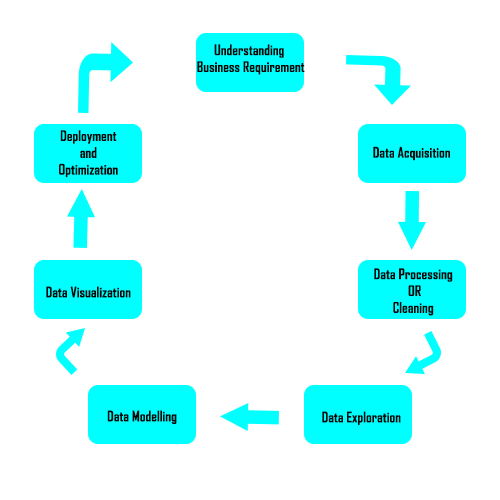

## Introduction
Data science is all about extracting knowledge and insights from data. 
Data science techniques have become more and more relevant in the world as we know it.
it is used in major applications like Netflix, Google, Amazon and so many more it’s also used for research purposes. 
if you wish to enter the Data science world here is a brief tutorial on a machine learning methods.
## The stages of Data Science
These are the different stages that data scientist partake when working on  to extract knowledge from data. To extract this information,
they employ various fit-to-purpose models based on machine learning algorithms, statistics, and mathematical methods.

### Understanding Business Requirement
This is one of the questions that a data scientist should ask. That is what is the objective of this project? What is my aim on analysing this data? What do I wish to predict? It is required of a data scientist or anyone that wishes to gain insight from a data raw or prepared to know what they are looking for.
